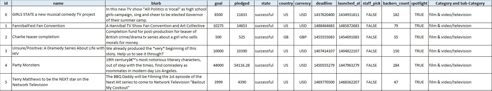
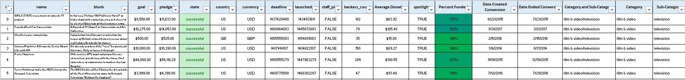
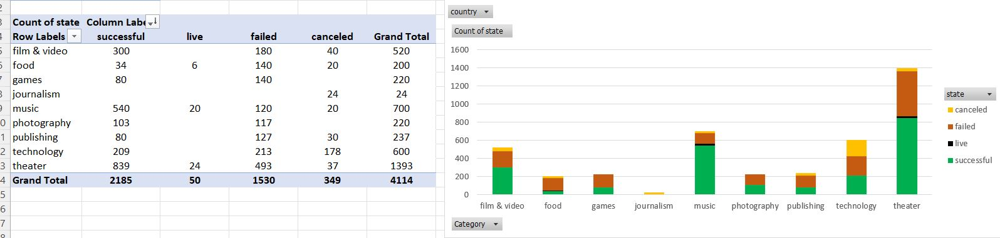
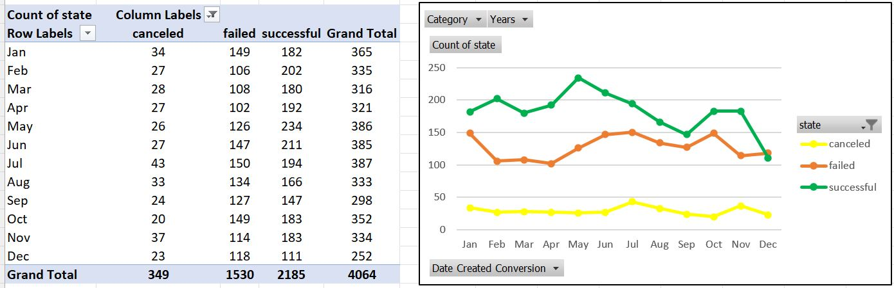
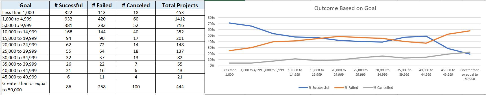
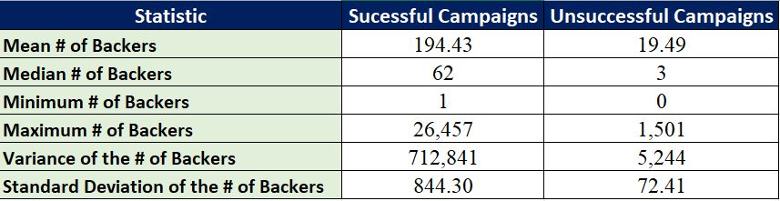

# Excel_Kickstarter
* This is my first homework assignment for the Data Analytics and Visualization Boot Camp that I took through the University of Pennsylvania . In this repo I use many excel features such as date function, iferror function, pivot tables, and pivot charts to analyze kickstarter data and find market trends

## System Requirements 
* The only software that you need for this repo is Microsoft Excel

## Data Engineering
* The starting spreadsheet, KickStarter_Starting_Data.xlsx

* Cleaned up spreadsheet with added calculation columns

## Python Tables

### Category Stats

### Sub-Category Stats

### Launched Month

### Outcome Based on Goal

### Number of Campaign Backers Statistical Analysis

## Conclusions
* To see my conclusions based on this pivot tables please reference the "Kicker Conclusions.docx" file. 
