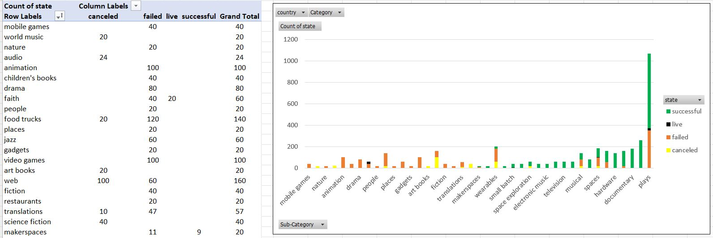

# Excel_Kickstarter
* Homework 1 for UPenn Data Analytics to use pivot tables, pivot charts, and many other excel functions to analyze kickstarter data and find market trends based on the analysis

### Starting Data 
* The starting spreadsheet, KickStarter_Starting_Data.xlsx, for this repo has over 4,000 kickstarter projects. 
* The columns in the starting spreadsheet are id, name, blurb, goal, pledged, state, country, currency, deadline, launched_at, staff_pick, backers_count, spotlight, and Category and Sub-Category. Each row in the dataset is one kickstarter campaign. 

#### Cleaning The Data
* When you are working with any new dataset the first two things that you should always do are one make sure that you understand the data and two make sure that the data is in a form that you can perform analysis on it. That is exactly what I did for this project. The column headers made the starting dataset very easy to understand. So onto cleaning the data. Most of the columns in the starting data are in a form that I can easily work with. However, deadline, launched_at, and Category and Sub Category are not in forms that I can use. Deadline and launched_at are not in Date format even though they are dates, so using a simple function they can be converted to dates. Next, category and sub-category are in the same column even though they should be 2 seperate fields. Using a spilt function this column can be broken up so that category and sub-category each have their own column. The average donation and percent funded were also calculated. After cleaning the starting and adding some new calculated columns here is the dataset:

### Analysis
* After cleaning the data I began to analyze the data to search for market trends. I wanted to see which fields had the biggest impact on whether a campaign was successful, failed or cancelled. To do this I created various pivot tables and pivotcharts to visualize the number of sucessful, failed, and cancelled campaigns based on different factors. First, I looked at it based on category, then sub-category, then launch month, then goal. 
* Additionally, I perforemd some statistical analysis on the data to see if the number of campaign backers was a good metric for success 

#### Category Stats

#### Sub-Category Stats

#### Launched Month

#### Outcome Based on Goal

#### Number of Campaign Backers Statistical Analysis

### Conclusions
* Just creating pivot tables and charts is not enough to say that you analyzed the data you also have to make some conclusions about what you think the tables and charts mean. For my conclusions on this repo please refernce the "Kicker Conclusions.docx" file. 
